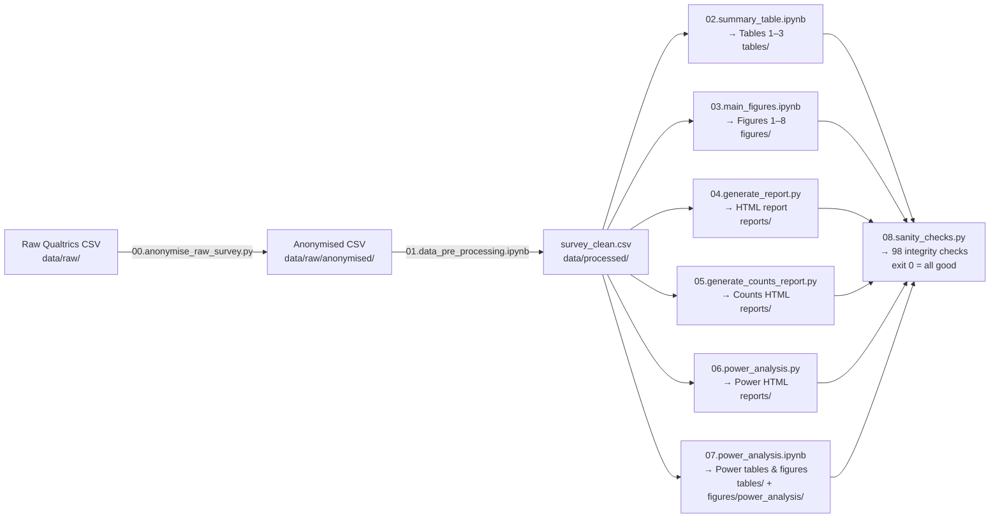

# Dental Trauma Knowledge Assessment — Master's Thesis Analysis

A reproducible Python analysis pipeline for a randomised survey study examining how
different reference resources (no resource, PDF, ChatGPT) affect dental-trauma
knowledge and self-confidence among medical providers.

---

## Table of Contents

1. [Project Overview](#1-project-overview)
2. [Repository Structure](#2-repository-structure)
3. [Analysis Pipeline](#3-analysis-pipeline)
4. [Prerequisites & Setup](#4-prerequisites--setup)
5. [Data Description](#5-data-description)
6. [Statistical Methods](#6-statistical-methods)
7. [Reproducing the Analysis](#7-reproducing-the-analysis)
8. [Scripts & Notebooks](#8-scripts--notebooks)
9. [Output Files](#9-output-files)

---

## 1. Project Overview

**Study design:** 18 medical providers were randomly assigned to one of three
resource groups before answering a 12-question dental-trauma knowledge quiz:

| Group | n | Resource |
|-------|---|----------|
| No Resource | 7 | No reference material |
| PDF | 5 | Printed/PDF reference guide |
| ChatGPT | 6 | Access to ChatGPT |

**Primary outcomes:**
- Knowledge score (`n_correct` out of 12)
- Per-question correctness rates across groups
- Self-rated confidence (`self_confidence_mean`, 0–10 scale)

**Research questions:**
1. Do knowledge scores differ significantly across resource groups?
2. Does self-rated confidence correlate with objective knowledge performance?
3. What sample size would be needed to detect effects of the observed magnitude?

---

## 2. Repository Structure

```
lauren_master_thesis/
├── data/
│   ├── raw/
│   │   ├── Medical Provider Dental Trauma Assessment_*.csv   # Raw Qualtrics export
│   │   └── anonymised/
│   │       ├── dental_trauma_survey_responses.csv            # De-identified data
│   │       └── answers_to_the_questions_form_questions.csv   # Answer key
│   └── processed/
│       ├── survey_clean.csv       # Final analysis-ready dataset
│       └── question_labels.csv    # Human-readable question labels
├── figures/
│   ├── main_boxplots/             # Figures 1–4 (group comparison boxplots)
│   ├── correlation/               # Figures 5–8 (confidence vs score scatter plots)
│   └── power_analysis/            # Figures PA1–PA3 (power curves)
├── tables/
│   ├── table1_summary.{csv,html,tex}       # Table 1: summary statistics
│   ├── table2_per_question.{csv,html,tex}  # Table 2: per-question correctness
│   ├── table3_correlation.csv              # Table 3: Spearman correlations
│   ├── power_analysis_summary.csv          # Power analysis summary
│   └── tables_summary.xlsx                 # All tables in one Excel workbook
├── reports/
│   ├── thesis_results_report.html          # Full HTML results report
│   ├── counts_report.html                  # Counts/frequency report
│   └── power_analysis_report.html          # Interactive power analysis report
├── scripts/
│   ├── 00.anonymise_raw_survey.py          # Step 0: remove PII
│   ├── 01.data_pre_processing.ipynb        # Step 1: clean & derive variables
│   ├── 02.summary_table.ipynb              # Step 2: Tables 1–3
│   ├── 03.main_figures.ipynb               # Step 3: Figures 1–8
│   ├── 04.generate_report.py               # Step 4: HTML report (legacy)
│   ├── 05.generate_counts_report.py        # Step 5: counts HTML report
│   ├── 06.power_analysis.py                # Step 6: power analysis HTML report
│   ├── 07.power_analysis.ipynb             # Step 7: power analysis (notebook)
│   └── 08.sanity_checks.py                 # Step 8: data integrity & statistical sanity checks
├── requirements.txt
└── README.md
```

---

## 3. Analysis Pipeline

The pipeline flows strictly from left to right. Each step reads from the output
of the previous step.



**Numbered script prefixes** indicate execution order. Note that `07.power_analysis.ipynb`
is numbered 07 (not 04) because scripts 04–06 are legacy HTML-report generators that
pre-date the notebook-based workflow. All primary reproducible outputs now live in the
numbered notebooks (`01`–`03`, `07`).

---

## 4. Prerequisites & Setup

**Python version:** 3.12

### Install dependencies

```powershell
# From the repo root — creates the virtual environment
python -m venv .venv
.venv\Scripts\Activate.ps1
pip install -r requirements.txt
```

### Key packages

| Package | Version | Purpose |
|---------|---------|---------|
| pandas | 3.0.2 | Data manipulation |
| numpy | 2.4.4 | Numerical operations |
| matplotlib | 3.10.8 | Static figures |
| seaborn | 0.13.2 | Statistical visualisation |
| scipy | 1.17.1 | Statistical tests (Kruskal-Wallis, chi-square, Spearman) |
| statsmodels | 0.14.6 | Non-central distributions for power analysis |
| openpyxl | 3.1.5 | Excel export |
| jupyter | 1.1.1 | Notebook execution |
| plotly | 6.7.0 | Interactive HTML reports (legacy scripts only) |

---

## 5. Data Description

### Raw data

The raw file is a Qualtrics CSV export with **three header rows**:
- Row 0: short variable names (used as column identifiers)
- Row 1: full question text
- Row 2: Qualtrics internal import IDs

Only responses with `Finished == True` and `Progress == 100` are kept in the
analysis (N = 18 after filtering).

### Anonymisation

`00.anonymise_raw_survey.py` removes the following columns before any analysis:

| Column | Reason removed |
|--------|---------------|
| IPAddress | Direct identifier |
| LocationLatitude / LocationLongitude | Precise geolocation |
| StartDate / EndDate / RecordedDate | Timestamped with timezone (quasi-identifier) |
| RecipientLastName / RecipientFirstName / RecipientEmail | PII |
| ExternalReference | PII link field |
| ResponseId | Qualtrics-internal identifier |
| Status / DistributionChannel / UserLanguage | Constant value, no analytic value |

### Processed dataset (`survey_clean.csv`)

Key columns in the analysis-ready dataset:

| Column | Type | Description |
|--------|------|-------------|
| `group_label` | ordered categorical | Experimental group: No Resource / PDF / ChatGPT |
| `duration_min` | float | Survey completion time in minutes |
| `education_level` | ordered categorical | Highest training level (Medical Student → Attending) |
| `specialty` | categorical | Clinical specialty |
| `self_knowledge_tdi` | float | Self-rated TDI knowledge (0–10) |
| `self_confidence_avulsion` | float | Confidence for avulsion cases (0–10) |
| `self_confidence_fracture` | float | Confidence for fracture cases (0–10) |
| `self_confidence_mean` | float | Mean of three confidence ratings (0–10) |
| `n_correct` | int | Number of correct answers (0–12) |
| `n_incorrect` | int | Number of incorrect answers |
| `n_not_sure` | int | Number of "not sure" responses |
| `pct_correct_of_attempted` | float | Correct / (correct + incorrect) × 100 |
| `c1_*_correct` … `c3_*_correct` | int (0/1) | Per-question correctness flags |

### Answer key

`data/raw/anonymised/answers_to_the_questions_form_questions.csv` maps each
question column to its correct answer. This file is loaded directly by
`01.data_pre_processing.ipynb` so the scoring stays in sync with the canonical answers.

---

## 6. Statistical Methods

### Between-group comparisons (Tables 1 & 2)

| Test | Variables | Rationale |
|------|-----------|-----------|
| **Kruskal-Wallis** rank-sum | All continuous / ordinal variables (knowledge scores, duration, self-confidence) | Non-parametric; selected a priori given small, unequal group sizes (n = 5–7) where parametric assumptions cannot be verified |
| **NT (not tested)** | Categorical demographics (education, specialty) | Expected cell counts < 5 in most cells of the contingency table — chi-square and Fisher's exact test assumptions violated |
| **Pearson chi-square** (2 × 3) | Per-question binary correctness across 3 groups (Table 2) | Binary outcome × 3 groups; Bonferroni-corrected α = 0.0042 for k = 12 simultaneous tests |

### Correlation analysis (Table 3 & Figures 5–8)

**Spearman's ρ** between `self_confidence_mean` and `n_correct`, computed for:
- All participants (n = 18)
- Each group separately (n = 5–7)

Spearman's rank correlation is used because both variables are ordinal and group sizes
are too small for normality assumptions. **Bonferroni-corrected** p-values are provided
(p × 4, adjusted α = 0.0125) for the four simultaneous tests.

### Power analysis (Table PA & Figures PA1–PA3)

Three analyses characterise the study's statistical power:

| Test | Effect size | Distribution |
|------|-------------|--------------|
| Kruskal-Wallis | Cohen's f (from η²) | Non-central F approximation |
| Chi-square (per question) | Cohen's w (median across 12 questions) | Non-central chi-square (df = 2) |
| Spearman correlation | ρ overall | Fisher z-transform normal approximation |

For each test the notebook reports:
- **Observed effect size** (from the actual data) with qualitative label (small/medium/large)
- **Achieved power** at the current N = 18
- **Minimum detectable effect** at N = 18 and 80% power (sensitivity analysis)
- **Required total N** to achieve 80% power at the observed effect size

> **Note on post-hoc power:** Observed ("post-hoc") power is *not* reported because
> it is mathematically equivalent to a transformation of the p-value and provides no
> additional inferential information. All power figures use the *observed effect size*
> as a fixed design parameter for sensitivity/prospective planning purposes.

---

## 7. Reproducing the Analysis

Run the steps in order from the repo root. Activate the virtual environment first.

```powershell
# Activate virtual environment (Windows PowerShell)
cd "c:\path\to\lauren_master_thesis"
.venv\Scripts\Activate.ps1
```

### Step 0 — Anonymise raw data (run once)

```powershell
python scripts/00.anonymise_raw_survey.py
```

Output: `data/raw/anonymised/dental_trauma_survey_responses.csv`

### Steps 1–3, 7 — Run notebooks

Open Jupyter and run the notebooks in order, or execute them from the command line:

```powershell
# Run all notebooks non-interactively (requires jupyter nbconvert)
.venv\Scripts\jupyter.exe nbconvert --to notebook --execute --inplace scripts/01.data_pre_processing.ipynb
.venv\Scripts\jupyter.exe nbconvert --to notebook --execute --inplace scripts/02.summary_table.ipynb
.venv\Scripts\jupyter.exe nbconvert --to notebook --execute --inplace scripts/03.main_figures.ipynb
.venv\Scripts\jupyter.exe nbconvert --to notebook --execute --inplace scripts/07.power_analysis.ipynb
```

Or launch Jupyter Lab and run them interactively:

```powershell
.venv\Scripts\jupyter.exe lab
```

### Steps 4–6 — Generate HTML reports (optional legacy scripts)

```powershell
python scripts/04.generate_report.py
python scripts/05.generate_counts_report.py
python scripts/06.power_analysis.py
```

These scripts generate interactive Plotly-based HTML reports in `reports/`.
The primary reproducible outputs (static figures and tables) are produced by the
notebooks instead.

### Step 8 — Verify data integrity (recommended after every full run)

```powershell
python scripts/08.sanity_checks.py
```

Runs 111 automated checks across five sections and exits with code 0 if
everything passes, 1 if any check fails. Expected output ends with:

```
  PASS: 98
  FAIL: 0
  WARN: 13   ← expected; all are chi-square cell-count notices (small N)

  All checks passed.
```

---

## 8. Scripts & Notebooks

### `scripts/00.anonymise_raw_survey.py`

**Role:** Pipeline Step 0 — must be run once before everything else.

Reads the raw Qualtrics CSV (3-header-row format), drops all PII and redundant
columns, and writes the de-identified dataset to `data/raw/anonymised/`. Also runs
8 integrity checks (row count, column count, round-trip, invariant columns) to
confirm the anonymisation did not corrupt or shift any data.

---

### `scripts/01.data_pre_processing.ipynb`

**Role:** Pipeline Step 1 — transforms the anonymised data into a clean analysis file.

| Section | Action |
|---------|--------|
| 1. Load raw data | Read 3-row Qualtrics CSV, skip metadata rows |
| 2. Filter complete responses | Keep `Finished == True` & `Progress == 100` |
| 3. Drop metadata columns | Remove redundant Qualtrics admin columns |
| 4. Rename columns | Short IDs → readable snake_case names |
| 5. Derive experimental group | Consent/prompt columns → `group_label` |
| 6. Fix data types | Cast to numeric/boolean |
| 7. Consolidate demographics | Merge role-branched specialty/education columns |
| 8. Encode ordered categoricals | `pd.Categorical` with explicit level order |
| 9. Score individual questions | Compare to answer key → `*_correct` columns (0/1) |
| 10. Summarise per respondent | Compute `n_correct`, `n_incorrect`, `n_not_sure` |
| 11. Final overview | Print shape, distributions, and summary statistics |
| 12. Save processed data | Write `data/processed/survey_clean.csv` |

---

### `scripts/02.summary_table.ipynb`

**Role:** Pipeline Step 2 — generates Tables 1, 2, and 3.

- **Table 1** — Four-panel summary statistics table (Demographics, Self-Assessment,
  Knowledge Outcomes, Survey Duration). Kruskal-Wallis p-values for continuous/ordinal
  variables; NT for sparse categorical variables.
- **Table 2** — Per-question correctness rates with chi-square p-values and
  Bonferroni corrections (k = 12).
- **Table 3** — Spearman rank correlations between `self_confidence_mean` and
  `n_correct` for all participants and each group separately.

All tables are exported as CSV, HTML, LaTeX, and consolidated in `tables_summary.xlsx`.

---

### `scripts/03.main_figures.ipynb`

**Role:** Pipeline Step 3 — generates eight static `matplotlib`/`seaborn` figures.

**Figures 1–4 (grouped boxplots + strip plots):**

| Figure | Variable(s) | Description |
|--------|-------------|-------------|
| 1 | `n_correct`, `n_incorrect`, `n_not_sure` | Knowledge outcome counts by group |
| 2 | `pct_correct_of_attempted` | Accuracy among attempted questions |
| 3 | `duration_min` | Survey completion time |
| 4 | `self_knowledge_tdi`, `self_confidence_*` | Self-assessment ratings |

Boxplots with individual data points overlaid (`stripplot`) are used so the full
distribution is visible with small group sizes (n = 5–7). Statistical p-values are
reported in Table 1.

**Figures 5–8 (scatter plots with OLS trend line):**

| Figure | Subset | Description |
|--------|--------|-------------|
| 5 | All Participants (n = 18) | Self-confidence vs knowledge score |
| 6 | No Resource (n = 7) | Self-confidence vs knowledge score |
| 7 | PDF (n = 5) | Self-confidence vs knowledge score |
| 8 | ChatGPT (n = 6) | Self-confidence vs knowledge score |

Each scatter plot is annotated with Spearman's ρ and p-value. Spearman correlation
test results are reported in full in Table 3.

---

### `scripts/04.generate_report.py`

**Role:** Legacy — generates `reports/thesis_results_report.html` with interactive
Plotly figures (Tables 1–3 and scatter plots). Superseded by notebooks 02 and 03
for primary reproducible outputs, but retained for the interactive HTML report.

---

### `scripts/05.generate_counts_report.py`

**Role:** Legacy — generates `reports/counts_report.html` with frequency and count
summaries for the survey responses.

---

### `scripts/06.power_analysis.py`

**Role:** Legacy — generates `reports/power_analysis_report.html` with interactive
Plotly power curves. The statistical logic in this script is the source for
`07.power_analysis.ipynb`.

---

### `scripts/07.power_analysis.ipynb`

**Role:** Pipeline Step 7 — comprehensive power analysis with static
`matplotlib`/`seaborn` figures and a summary table.

> **Why numbered 07?** Scripts 04–06 are legacy HTML-report generators. The notebook
> workflow (01–03) came first; 07 extends it without renumbering the existing scripts.

| Section | Content |
|---------|---------|
| 1. Observed Effect Sizes | Compute Cohen's f (KW), Cohen's w (chi-square), Spearman ρ |
| 2. Power Functions | Implement non-central F, chi-square, and Fisher-z power primitives |
| 3. Summary Table | Sensitivity analysis + required N at 80% power |
| Figure PA1 | Kruskal-Wallis power curve |
| Figure PA2 | Chi-square power curves (unadjusted and Bonferroni α) |
| Figure PA3 | Spearman correlation power curves (overall and per group) |

---

### `scripts/08.sanity_checks.py`

**Role:** Pipeline Step 8 — automated data integrity and statistical sanity checks.
Run after every full pipeline execution to confirm no silent errors were introduced.

```powershell
python scripts/08.sanity_checks.py
```

Prints colour-coded PASS / FAIL / WARN for each check and exits with code 0 if
all pass, 1 if any fail. The 13 expected WARNs are chi-square expected-cell-count
notices inherent to the small sample size (N = 18) and require no action.

| Section | Checks |
|---------|--------|
| **1. Structure** | Shape (18 × 42), column names, no duplicates, group composition, no NaN in critical columns, value ranges |
| **2. Scoring** | Re-derives all 12 `*_correct` flags from the answer key; re-computes `n_correct`, `n_incorrect`, `n_not_sure`, and `pct_correct_of_attempted`; verifies `n_correct + n_incorrect + n_not_sure == 12` for every row |
| **3. Derived columns** | `self_confidence_mean == round(mean(3 ratings), 2)` and `duration_min == round(duration_sec / 60, 2)` |
| **4. Statistical reproducibility** | Re-runs Spearman correlations (Table 3), Bonferroni adjustments (k = 4), Kruskal-Wallis on `n_correct`, and per-question chi-square tests (Table 2, Bonferroni k = 12); compares to saved table files |
| **5. Cross-script consistency** | Confirms `tables/table3_correlation.csv` matches freshly computed Spearman values (verifying scripts 02 and 04 produced the same results), and that Bonferroni multipliers are encoded consistently in both Table 2 and Table 3 |

---

## 9. Output Files

### Tables (`tables/`)

| File | Description |
|------|-------------|
| `table1_summary.csv` | Table 1 as CSV |
| `table1_summary.html` | Table 1 as styled HTML |
| `table1_summary.tex` | Table 1 as LaTeX |
| `table2_per_question.csv` | Table 2 as CSV |
| `table2_per_question.html` | Table 2 as styled HTML |
| `table2_per_question.tex` | Table 2 as LaTeX |
| `table3_correlation.csv` | Table 3 Spearman correlations as CSV |
| `power_analysis_summary.csv` | Power analysis summary (effect sizes, required N) |
| `tables_summary.xlsx` | All tables in one Excel workbook (3 sheets) |

### Figures (`figures/`)

| File | Description |
|------|-------------|
| `main_boxplots/fig1_knowledge_outcomes.[png\|pdf]` | Figure 1: knowledge outcome counts |
| `main_boxplots/fig2_pct_correct.[png\|pdf]` | Figure 2: accuracy % |
| `main_boxplots/fig3_completion_time.[png\|pdf]` | Figure 3: survey duration |
| `main_boxplots/fig4_self_assessment.[png\|pdf]` | Figure 4: self-assessment ratings |
| `correlation/fig5_corr_all.[png\|pdf]` | Figure 5: confidence vs score, all |
| `correlation/fig6_corr_no_resource.[png\|pdf]` | Figure 6: confidence vs score, No Resource |
| `correlation/fig7_corr_pdf.[png\|pdf]` | Figure 7: confidence vs score, PDF |
| `correlation/fig8_corr_chatgpt.[png\|pdf]` | Figure 8: confidence vs score, ChatGPT |
| `power_analysis/fig_pa1_kw_power_curve.[png\|pdf]` | Figure PA1: Kruskal-Wallis power curve |
| `power_analysis/fig_pa2_chisq_power_curves.[png\|pdf]` | Figure PA2: chi-square power curves |
| `power_analysis/fig_pa3_spearman_power_curves.[png\|pdf]` | Figure PA3: Spearman power curves |

PNG files are saved at 600 dpi for publication quality. PDF files are included for
vector-format figures suitable for thesis submission.

### Reports (`reports/`)

| File | Description |
|------|-------------|
| `thesis_results_report.html` | Full interactive Plotly results report |
| `counts_report.html` | Response frequency / counts report |
| `power_analysis_report.html` | Interactive power analysis with Plotly |

---

*For questions about this analysis, consult the thesis document or open an issue in
this repository.*
